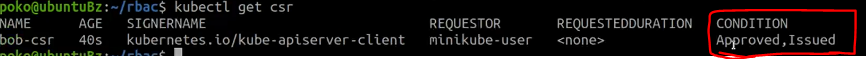
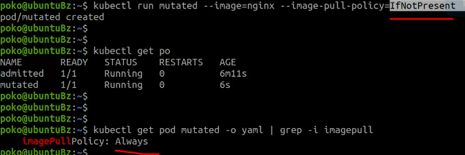

# K8s_Authentication-Authorization-and-Admission-Control
To access and manage Kubernetes resources or objects in the cluster, we need to access a specific API endpoint on the API server. Each access request goes through the following access control stages:

**Authentication**

Authenticate a user based on credentials provided as part of API requests.

**Authorization**

Authorizes the API requests submitted by the authenticated user.

**Admission Control**

Software modules that validate and/or modify user requests.

The following image depicts the above stages:


## Authentication
Kubernetes does not have an object called user, nor does it store usernames or other related details in its object store. However, even without that, Kubernetes can use usernames for the Authentication phase of the API access control, and to request logging as well.

Kubernetes supports two kinds of users:

**Normal Users**

They are managed outside of the Kubernetes cluster via independent services like User/Client Certificates, a file listing usernames/passwords, Google accounts, etc.

**Service Accounts**

Service Accounts allow in-cluster processes to communicate with the API server to perform various operations. Most of the Service Accounts are created automatically via the API server, but they can also be created manually. The Service Accounts are tied to a particular Namespace and mount the respective credentials to communicate with the API server as Secrets.

If properly configured, Kubernetes can also support anonymous requests, along with requests from Normal Users and Service Accounts. User impersonation is also supported allowing a user to act as another user, a helpful feature for administrators when troubleshooting authorization policies.

For authentication, Kubernetes uses a series of authentication modules:

* X509 Client Certificates:

To enable client certificate authentication, we need to reference a file containing one or more certificate authorities by passing the --client-ca-file=SOMEFILE option to the API server. The certificate authorities mentioned in the file would validate the client certificates presented by users to the API server. A demonstration video covering this topic can be found at the end of this chapter.

* Static Token File:
  
We can pass a file containing pre-defined bearer tokens with the --token-auth-file=SOMEFILE option to the API server. Currently, these tokens would last indefinitely, and they cannot be changed without restarting the API server.

* Bootstrap Tokens:
  
Tokens used for bootstrapping new Kubernetes clusters.

* Service Account Tokens:
  
Automatically enabled authenticators that use signed bearer tokens to verify requests. These tokens get attached to Pods using the Service Account Admission Controller, which allows in-cluster processes to talk to the API server.

* OpenID Connect Tokens:
  
OpenID Connect helps us connect with OAuth2 providers, such as Microsoft Entra ID (previously known as Azure Active Directory), Salesforce, and Google, to offload the authentication to external services.

* Webhook Token Authentication:
  
With Webhook-based authentication, verification of bearer tokens can be offloaded to a remote service.

* Authenticating Proxy:
  
Allows for the programming of additional authentication logic.

We can enable multiple authenticators, and the first module to successfully authenticate the request short-circuits the evaluation. To ensure successful user authentication, we should enable at least two methods: the service account token authenticator and one of the user authenticators.

## Authorization (1) 
  
After a successful authentication, users can send the API requests to perform different operations. Here, these API requests get authorized by Kubernetes using various authorization modules that allow or deny the requests.

Some of the API request attributes that are reviewed by Kubernetes include user, group, Resource, Namespace, or API group, to name a few. Next, these attributes are evaluated against policies. If the evaluation is successful, then the request is allowed, otherwise it is denied. Similar to the Authentication step, Authorization has multiple modules, or authorizers. More than one module can be configured for one Kubernetes cluster, and each module is checked in sequence. If any authorizer approves or denies a request, then that decision is returned immediately.

* Node
  
Node authorization is a special-purpose authorization mode which specifically authorizes API requests made by kubelets. It authorizes the kubelet's read operations for services, endpoints, or nodes, and writes operations for nodes, pods, and events. For more details, please review the Node authorization documentation.

* Attribute-Based Access Control (ABAC)

With the ABAC authorizer, Kubernetes grants access to API requests, which combine policies with attributes. In the following example, user bob can only read Pods in the Namespace lfs158.

```yaml
{
  "apiVersion": "abac.authorization.kubernetes.io/v1beta1",
  "kind": "Policy",
  "spec": {
    "user": "bob",
    "namespace": "lfs158",
    "resource": "pods",
    "readonly": true
  }
}

```

To enable ABAC mode, we start the API server with the --authorization-mode=ABAC option, while specifying the authorization policy with --authorization-policy-file=PolicyFile.json. For more details, please review the ABAC authorization documentation.

* Webhook
* 
In Webhook mode, Kubernetes can request authorization decisions to be made by third-party services, which would return true for successful authorization, and false for failure. In order to enable the Webhook authorizer, we need to start the API server with the --authorization-webhook-config-file=SOME_FILENAME option, where SOME_FILENAME is the configuration of the remote authorization service. For more details, please see the Webhook mode documentation.


# Authorization (2)

*Role-Based Access Control (RBAC)

In general, with RBAC we regulate the access to resources based on the Roles of individual users. In Kubernetes, multiple Roles can be attached to subjects like users, service accounts, etc. While creating the Roles, we restrict resource access by specific operations, such as create, get, update, patch, etc. These operations are referred to as verbs. In RBAC, we can create two kinds of Roles:

* Role
A Role grants access to resources within a specific Namespace.

* ClusterRole
* 
A ClusterRole grants the same permissions as Role does, but its scope is cluster-wide.

In this course, we will focus on the first kind, Role. Below you will find an example:


```yaml
apiVersion: rbac.authorization.k8s.io/v1
kind: Role
metadata:
  namespace: lfs158
  name: pod-reader
rules:
- apiGroups: [""] # "" indicates the core API group
  resources: ["pods"]
  verbs: ["get", "watch", "list"]

```

The manifest defines a pod-reader role, which has access only to read the Pods of lfs158 Namespace.

For comparison, a ClusterRole example is provided below:

```yaml
apiVersion: rbac.authorization.k8s.io/v1
kind: ClusterRole
metadata:
  name: cluster-admin
rules:
- apiGroups:
  - '*' # All API groups
  resources:
  - '*' # All resources
  verbs:
  - '*' # All operations
- nonResourceURLs:
  - '*' # All non resource URLs, such as "/healthz"
  verbs:
  - '*' # All operations

```

The manifest defines a cluster-admin cluster role that is fully permissive.

Once the role is created, we can bind it to users with a RoleBinding object. There are two kinds of RoleBindings:

* RoleBinding
* 
It allows us to bind users to the same namespace as a Role. We could also refer to a ClusterRole in RoleBinding, which would grant permissions to Namespace resources defined in the ClusterRole within the RoleBinding’s Namespace.

* ClusterRoleBinding
  
It allows us to grant access to resources at a cluster-level and to all Namespaces.

In this course, we will focus on the first kind, RoleBinding. Below, you will find an example:


```yaml
apiVersion: rbac.authorization.k8s.io/v1
kind: RoleBinding
metadata:
  name: pod-read-access
  namespace: lfs158
subjects:
- kind: User
  name: bob
  apiGroup: rbac.authorization.k8s.io
roleRef:
  kind: Role
  name: pod-reader
  apiGroup: rbac.authorization.k8s.io

```

The manifest defines a bind between the pod-reader Role and user bob, to restrict the user to only read the Pods of the lfs158 Namespace.

For comparison, a ClusterRoleBinding example is provided below:

```yaml
apiVersion: rbac.authorization.k8s.io/v1
kind: ClusterRoleBinding
metadata:
  name: cluster-admin
roleRef:
  apiGroup: rbac.authorization.k8s.io
  kind: ClusterRole
  name: cluster-admin
subjects:
- apiGroup: rbac.authorization.k8s.io
  kind: Group
  name: system:admins

```

The manifest defines a bind between the cluster-admin ClusterRole and all users of the group system:admins.

To enable the RBAC mode, we start the API server with the --authorization-mode=RBAC option, allowing us to dynamically configure policies. For more details, please review the RBAC mode.


## Authentication and Authorization Demo Guide (1)
This exercise guide assumes the following environment, which by default uses the certificate and key from /var/lib/minikube/certs/, and RBAC mode for authorization:

Minikube v1.32.0

* Kubernetes v1.28

* containerd 1.7.8

This exercise guide was prepared for the video demonstration available at the end of this chapter.

Start Minikube:

```bash
minikube start
```

View the content of the kubectl client's configuration manifest, observing the only context minikube and the only user minikube, created by default (the output has been redacted for readability):

```bash
kubectl config view
```

```yaml
apiVersion: v1
clusters:
- cluster:
    certificate-authority: /home/student/.minikube/ca.crt
    server: https://192.168.99.100:8443
  name: minikube
contexts:
- context:
    cluster: minikube
    namespace: default
    user: minikube
  name: minikube
current-context: minikube
kind: Config
preferences: {}
users:
- name: minikube
  user:
    client-certificate: /home/student/.minikube/profiles/minikube/client.crt
    client-key: /home/student/.minikube/profiles/minikube/client.key
```

# Authentication and Authorization Demo Guide (2)
Create lfs158 namespace:

```bash
$ kubectl create namespace lfs158
```
Create the rbac directory and cd into it:

```bash
$ mkdir rbac
$ cd rbac/

```
Create a new user bob on your workstation, and set bob's password as well (the system will prompt you to enter the password twice) :

```bash
~/rbac$ sudo useradd -s /bin/bash bob

~/rbac$ sudo passwd bob

```

Create a private key for the new user bob with the openssl tool, then create a certificate signing request for bob with the same openssl tool:

```bash
~/rbac$ openssl genrsa -out bob.key 2048
```

Generating RSA private key, 2048 bit long modulus (2 primes)
.................................................+++++
.........................+++++
e is 65537 (0x010001)

```bash
~/rbac$ openssl req -new -key bob.key \
  -out bob.csr -subj "/CN=bob/O=learner"

```

Create a YAML definition manifest for a certificate signing request object, and save it with a blank value for the request field:

```bash
~/rbac$ vim signing-request.yaml

```

```yaml
apiVersion: certificates.k8s.io/v1
kind: CertificateSigningRequest
metadata:
  name: bob-csr
spec:
  groups:
  - system:authenticated
  request: <assign encoded value from next cat command>
  signerName: kubernetes.io/kube-apiserver-client
  usages:
  - digital signature
  - key encipherment
  - client auth
```


# Authentication and Authorization Demo Guide (3)

View the certificate, encode it in base64, and assign it to the request field in the signing-request.yaml file:

```bash
~/rbac$ cat bob.csr | base64 | tr -d '\n','%'
```

LS0tLS1CRUd...1QtLS0tLQo=

```bash
~/rbac$ vim signing-request.yaml

```


```yaml
apiVersion: certificates.k8s.io/v1
kind: CertificateSigningRequest
metadata:
  name: bob-csr
spec:
  groups:
  - system:authenticated
  request: LS0tLS1CRUd...1QtLS0tLQo=
  signerName: kubernetes.io/kube-apiserver-client
  usages:
  - digital signature
  - key encipherment
  - client auth
```

Create the certificate signing request object, then list the certificate signing request objects. It shows a pending state:

```bash
~/rbac$ kubectl create -f signing-request.yaml

```

certificatesigningrequest.certificates.k8s... create

```bash
~/rbac$ kubectl get csr

```

NAME AGE SIGNERNAME REQUESTOR CONDITION

bob-csr 12s kubernetes.io/kube-apiserver-client minikube-user Pending

Approve the certificate signing request object, then list the certificate signing request objects again. It shows both approved and issued states:

```bash
~/rbac$ kubectl certificate approve bob-csr

```

certificatesigningrequest.certificates.k8s... approved

```bash
~/rbac$ kubectl get csr

```

NAME AGE SIGNERNAME REQUESTOR CONDITION

bob-csr 57s kubernetes.io/kube-apiserver-client minikube-user Approved,Issued

# Authentication and Authorization Demo Guide (4)
Extract the approved certificate from the certificate signing request, decode it with base64 and save it as a certificate file. Then view the certificate in the newly created certificate file:

```bash
~/rbac$ kubectl get csr bob-csr \
  -o jsonpath='{.status.certificate}' | \
  base64 -d > bob.crt

~/rbac$ cat bob.crt

```

-----BEGIN CERTIFICATE-----
MIIDGzCCA...
...
...NOZRRZBVunTjK7A==
-----END CERTIFICATE-----

Configure the kubectl client's configuration manifest with user bob's credentials by assigning his key and certificate:

```bash
~/rbac$ kubectl config set-credentials bob \
  --client-certificate=bob.crt --client-key=bob.key

```

User "bob" set.

Create a new context entry in the kubectl client's configuration manifest for user bob, associated with the lfs158 namespace in the minikube cluster:

```bash
~/rbac$ kubectl config set-context bob-context \
  --cluster=minikube --namespace=lfs158 --user=bob

```

Context "bob-context" created

View the contents of the kubectl client's configuration manifest again, observing the new context entry bob-context, and the new user entry bob (the output is redacted for readability):


```bash
~/rbac$ kubectl config view

```


```yaml
apiVersion: v1
clusters:
- cluster:
    certificate-authority: /home/student/.minikube/ca.crt
    ...
    server: https://192.168.99.100:8443
  name: minikube
contexts:
- context:
    cluster: minikube
    ...
    user: minikube
  name: minikube
- context:
    cluster: minikube
    namespace: lfs158
    user: bob
  name: bob-context
current-context: minikube
kind: Config
preferences: {}
users:
- name: minikube
  user:
    client-certificate: /home/student/.minikube/profiles/minikube/client.crt
    client-key: /home/student/.minikube/profiles/minikube/client.key
- name: bob
  user:
    client-certificate: /home/student/rbac/bob.crt
    client-key: /home/student/rbac/bob.key

```

# Authentication and Authorization Demo Guide (5)

While in the default minikube context, create a new deployment in the lfs158 namespace:

```bash
~/rbac$ kubectl -n lfs158 create deployment nginx --image=nginx:alpine
```

deployment.apps/nginx created

From the new context bob-context try to list pods. The attempt fails because user bob has no permissions configured for the bob-context:


```bash
~/rbac$ kubectl --context=bob-context get pods

```

Error from server (Forbidden): pods is forbidden: User "bob" cannot list resource "pods" in API group "" in the namespace "lfs158"

The following steps will assign a limited set of permissions to user bob in the bob-context.

Create a YAML configuration manifest for a pod-reader Role object, which allows only get, watch, list actions/verbs in the lfs158 namespace against pod resources. Then create the role object and list it from the default minikube context, but from the lfs158 namespace:


```bash
~/rbac$ vim role.yaml

```

```yaml
apiVersion: rbac.authorization.k8s.io/v1
kind: Role
metadata:
  name: pod-reader
  namespace: lfs158
rules:
- apiGroups: [""]
  resources: ["pods"]
  verbs: ["get", "watch", "list"]

```

```bash
~/rbac$ kubectl create -f role.yaml

```

role.rbac.authorization.k8s.io/pod-reader created

```bash
~/rbac$ kubectl -n lfs158 get roles
```

NAME CREATED AT
pod-reader 2022-04-11T03:47:45Z

Authentication and Authorization Demo Guide (6)
Create a YAML configuration manifest for a rolebinding object, which assigns the permissions of the pod-reader Role to user bob. Then create the rolebinding object and list it from the default minikube context, but from the lfs158 namespace:

```bash
~/rbac$ vim rolebinding.yaml
```

```yaml
apiVersion: rbac.authorization.k8s.io/v1
kind: RoleBinding
metadata:
  name: pod-read-access
  namespace: lfs158
subjects:
- kind: User
  name: bob
  apiGroup: rbac.authorization.k8s.io
roleRef:
  kind: Role
  name: pod-reader
  apiGroup: rbac.authorization.k8s.io

```

```bash
~/rbac$ kubectl create -f rolebinding.yaml

```

rolebinding.rbac.authorization.k8s.io/pod-r.. created

```bash
~/rbac$ kubectl -n lfs158 get rolebindings

```
NAME ROLE AGE
pod-read-access Role/pod-reader 28s

Now that we have assigned permissions to bob, we can successfully list pods from the new context bob-context.

```bash
~/rbac$ kubectl --context=bob-context get pods

```
NAME READY STATUS RESTARTS AGE
nginx-565785f75c-kl25r 1/1 Running 0 7m41s


# Demo: Authentication and Authorization

We will demonstrate how to set up a new user for authentication and authorization with the API server of our Kubernetes clusters.

So let's navigate to our terminal and first let's create a new namespace. Then let's create a new sub directory, and let's cd into this new sub directory. Now let's create the new user. And his name is bob.

```bash
kubectl create namespace lsf158

```

```bash
mkdir rbac
cd rbac
#create new user
sudo useradd -s /bin/bash bob
```

Let's also set up a password for bob.

```bash
sudo passwd bob

```

Give password correctly and remember it.

Then we reopen SSL tool. We are going to create a key.

```bash
openssl genrsa -out bob.key 2048

```

Now the key has been generated and with the same open SSL tool, we are going to create a certificate signing request for bob.

```bash
openssl req -new -key bob.key -out bob.csr -subj "/CN=bob/0=learner"

```

Now this request created. we need to create a certificate signing request.

```bash
Now this request created. we need to create a certificate signing request.
```

resource of the Kubernetes cluster.

Assign encoded value from next cat command to spec > request options.

```bash
cat bob.csr | base64 | tr -d '\n','%'

```

Output will looks like:


yaml file will like this:


```yaml
apiVersion: certificates.k8s.io/v1
kind: CertificateSigningRequest
metadata:
  name: bob-csr
spec:
  groups:
  - system:authenticated
  request: <Assign encoded value from next cat command to spec>
  signerName: kubernetes.io/kube-apiserver-client
  usages:
  - digital signature
  - key encipherment
  - client auth

```

we can save this. And now we can safely create the signing request.

```bash
~/rbac$ kubectl create -f signing-request.yaml

```

Once the signing request is created let's list certificate signing requests to ensure that it has been created.

```bash
~/rbac$ kubectl get csr

```


So bob has a certificate signing request requested by the minikube-user, and it is still in a Pending state.

And now the next step is to approve bob's certificate signing request.

```bash
~/rbac$ kubectl certificate approve bob-csr

```


Now see the certificate signing request again.

```bash
~/rbac$ kubectl get csr

```

Output:



It has been approved, but let's also list the request one more time to see that the condition has changed to Approved and Issued.

Now let's extract it and store it into an actual certificate file.

```bash
kubectl get csr bob-csr -o jsonpath='{.status.certificate}' | base64 -d > bob.crt

```

So bob.crt is bob's certificate file.


And this is bob's certificate.

Now that the key for bob has been generated and the certificate is being created as well, we are ready to set up our kubeconfig file.

First, we need to add bob's credentials to the kubeconfig file, his certificate and his key.

```bash
~/rbac$ kubectl config set-credentials bob --client-certificate=bob.crt --client-key=bob.key
## output shout like this:
User "bob" set.

```

Then what we need to do is set up a context for bob.

```bash
~/rbac$ kubectl config set-context bob-context --cluster=minikube --namespace=lfs158 --user=bob
#output will looks like:
Context "bob-context" created.

```

A binding between the minikube cluster, the new namespace and the user bob, which will be used for access control policies.

Now let's review the kubeconfig file:

```bash
kubectl config view

```


We will see that originally we only had the minikube user. Now we have an additional user, user bob. Then in the context area, we have the original context, the minikube context and the new bob context. While the cluster is just one, the minikube cluster.

So let's create a new deployment in our new namespace.

```bash
~/rbac$ kubectl -n lfs158 create deployment nginx --image=nginx:alpine

```


So a new deployment nginex in the LFS158 namespace.

So from the bob context, so assuming it's bob's identity, let's try to list pods in the LFS158 namespace.

```bash
~/rbac$ kubectl --context=bob-context get pods

```


Now because bob doesn't have any permissions in the cluster, access is forbidden. So bob cannot do anything at this moment.

So let's create some role-based access control policies.

```bash
~/rbac$ vim role.yaml

```

```yaml
apiVersion: rbac.authorization.k8s.io/v1
kind: Role
metadata:
  name: pod-reader
  namespace: lfs158
rules:
- apiGroups: [""]
  resources: ["pods"]
  verbs: ["get", "watch", "list"]

```

So first we are going to create a role. A role that grants read-only access to users, "get", "watch", "list". We'll save and exit.

We will create this role, with the 'kubectl create' command.


```bash
~/rbac$ kubectl create -f role.yaml

```

Expected output.


And then what we are going to do next is create a role binding.

First, we need to create a role binding resource.

```bash
~/rbac$ vim rolebinding.yaml

```

```yaml
apiVersion: rbac.authorization.k8s.io/v1
kind: RoleBinding
metadata:
  name: pod-read-access
  namespace: lfs158
subjects:
- kind: User
  name: bob
  apiGroup: rbac.authorization.k8s.io
roleRef:
  kind: Role
  name: pod-reader
  apiGroup: rbac.authorization.k8s.io

```

So this is the definition file that binds the pod-reader user or role with user bob. It's very simple. Save and exit.

We create this with a 'kubectl create' command.

```bash
~/rbac$ kubectl create -f rolebinding.yaml

```

And one more time we validate.To see whether from the bob context, we can list pods in the LFS158 namespace.

```bash
~/rbac$ kubectl --context=bob-context get pods

```


And as it turns out, that after the access control policy has been set and user bob has been granted some restricted permissions in the cluster, now user bob is able to list pods in the LFS158 namespace.


# Admission Control

Admission controllers are used to specify granular access control policies, which include allowing privileged containers, checking on resource quota, etc. We force these policies using different admission controllers, like LimitRanger, ResourceQuota, DefaultStorageClass, AlwaysPullImages, etc. They come into effect only after API requests are authenticated and authorized. Admission controllers fall under two categories - validating or mutating, but there are controllers that are both validating and mutating. The mutating controllers can modify the requested objects.

To use admission controls, we must start the Kubernetes API server with the --enable-admission-plugins, which takes a comma-delimited, ordered list of controller names, such as:

--enable-admission-plugins=NamespaceLifecycle,ResourceQuota,PodSecurity,DefaultStorageClass

Kubernetes has some admission controllers enabled by default. For more details, please review the list of admission controllers.

Kubernetes admission control can also be implemented though custom plugins, for a dynamic admission control method. These plugins are developed as extensions and run as admission webhooks.

# Demo: Getting Started with Admission Controllers

We demonstrate how to get started with admission controllers and their effect on future application deployments.

We will focus on the AlwaysPullImages controller and mutating controller that intercepts our requests, and it will modify the imagePullPolicy of every part of definition to always show "Always".

So regardless of the policy that we define in the pod specification, whether it is "Never" or IfNotPresent", those values will be replaced by "Always".

So let's go to the command line and let's get started. So first I want to see what admission controllers are enabled by default in our API server.

```bash
~$ kubectl -n kube-system describe pod kube-apiserver-minikube | grep -i admission
```

So we run the 'kubectl describe pod' command and will describe the kube-apiserver of the minikube cluster, and we will grep for admission.


So the return is the --enable-admission-plugins option of the API server. And we get to see the list of admission plugins that are enabled by default.

Now let's try to deploy an application without the AlwaysPullImages admission controller enabled.

Okay. So without it, we are going to run a simple pod. We'll call it "admitted".

```bash
~$ kubectl run admitted --image=nginx --image-pull-policy=IfNotPresent
```

Our --image-pull-policy that we are defining will be "IfNotPresent". So the pod specification will show this imagePullPolicy.


So pod admitted has been created. I can validate this with 'kubectl get pods'.


So I see that "admitted" is in a Running state. And if I want to verify its imagePullPolicy, I can run the 'kube control get pod' in a yaml output. And I will grep for the imagepull entry.


```bash
kubectl get pod admitted -o yaml | grep -i imagepull

```


And here it is, the imagePullPolicy of my "admitted" pod is still "IfNotPresent". It is the same as defined in the 'kubectl run' command.

Now let's try to enable the admission controller. For that we need to ssh into the minikube node.


```bash
~$ minikube ssh
```

And then here, I want to take a quick look at the admission controller line that is part of the manifest defining the kube-apiserver pod.

```bash
$ sudo grep admission /etc/kubernetes/manifests/kube-apiserver.yaml
```

It returns the same output as before, the same admission plugins enabled.

Now the is a critical step that I highly recommend every time when planning to make changes to the API server to make a copy of that kube-apiserver.yaml file.

So in this case, I will make a copy of the /etc/kubernetes/manifest/kube-apiserver to (root) /kube-apiserver-yaml-backup.


```bash
$ sudo cp /etc/kubernetes/manifests/kube-apiserver.yaml /kube-apiserver-yaml-backup
```

In case I make changes that are unwanted and I delete the wrong thing, I modify something that I did not intend to do, and my API server no longer starts, no longer operates as expected, I can always revert back to this copy which supposedly it's the unaltered original version of the API yaml file.


So I strongly, strongly recommend that you copy this file, that you make a backup of it.

So now let's edit the kube-apiserver.yaml file. So we're going to run 'sudo vi'. We're not running vim because vim is not installed on the minikube VM, but vi Is there. So, 'sudo vi'.

```bash
$ sudo vi /etc/kubernetes/manifests/kube-apiserver.yaml
```

And now all we need to do is go into an insert mode, so I'm pressing the "i" key, scroll down to the enable-admission-plugins line.


So this, this one here and then go all the way to the end.And then, after the last ResourceQuota admission plugin type the AlwaysPullImages plugin but make sure that you're inserting a comma between the ResourceQuota and the AlwaysPullImages. So the comma is right here. And then there's nothing after the PullImages.


And as of now, we're done with the minikube VM. So we exit, we return to our workstation.

But now since we modified the API server's definition manifest, the node controller of the control plane node will force restart the API server.


So right now the API server is offline. It is being restarted by the node controller and while it is restarted, it no longer responds to kubectl commands.

So we need to give it around 20 seconds, maybe 15, maybe 30 depending on the speed of your system but it shouldn't take longer than that.

And the first time when it comes back and it responds in a positive fashion, we will see that some of the pods, they may be in Running or Pending state or maybe other states, it's just for the cluster to readjust to the modified API server.


So give it maybe another 10 seconds, another 15 seconds, and try the 'kubectl get pods' from all namespaces, command.

And when you see that consistently every pod in the kube-system namespace is in a Running state then it is safe for us to proceed.


So at this point, I want to validate that my API server runs with my AlwaysPullImages controller, admission controller enabled.

```bash
~$ kubectl -n kube-system describe pod kube-apiserver-minikube | grep -i admission
```


And it seems that the same output that before did not include the Alwayspullimages; now it does.

So this means that it is enabled by the API server. So let's see how this impacts a new pod.

So I want to run a new pod, 'kubectl run'. This will be a mutated pod. So originally I want my --image-pull-policy to say "IfNotPresent", just like the first pod, the "admitted" pod.


```bash
~$ kubectl run admitted --image=nginx --image-pull-policy=IfNotPresent
```


So I run this. I run the 'kubectl get pods' command.


And it seems that both pods are running the admitted and the mutated one.

However, if I validate the mutated pod, I validate its yaml output. And I grep for the imagepull. The imagePull has been modified to "Always" even though we've provided the "IfNotPresent" policy for the 'kubectl run' command.

```bash
~$ kubectl get pod mutated -o yaml | grep -i imagepull
```




Now this proves that the admission controller, the AlwaysPullImages admission controller, has mutated, has modified my second request, the 'kubectl run' of the mutated pod.

But what about the first one, the "admitted" pod. So let's run the command that we have run earlier to validate its imagePullPolicy.


```bash
~$ kubectl get pod admitted -o yaml | grep -i imagepull
```


And it seems that the "admitted" pod, deployed prior to the enablement of the AlwaysPullImages admission controller is not modified. So it runs based on its original configuration.
